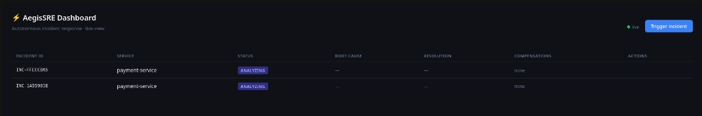
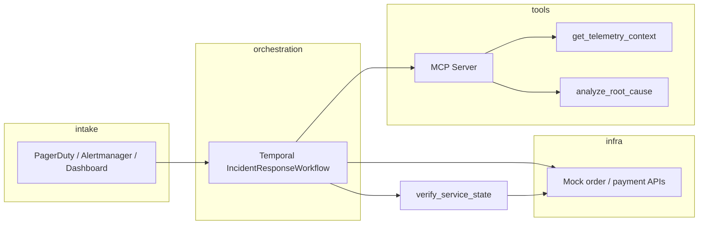

# Autonomous SRE Orchestration Swarm

A proof-of-concept for an agent-driven Site Reliability Engineering system that autonomously detects distributed microservice failures, identifies root cause, and dynamically orchestrates semantic rollbacks—with **post-rollback verification** so “resolved” means the order and payment state actually match the plan.



## Why we win

Plenty of hackathon and conference demos describe “autonomous SRE agents” with architecture slides and mocked UI. **We saw similar projects in the space—but most stop at the story.** AegisSRE is wired end-to-end: Temporal durable workflows, a stateless MCP tool server, LLM or heuristic root-cause analysis, saga compensations against real HTTP mock services, and a verification pass that re-reads order/payment state before closing the incident.

Judges can **`docker compose up --build`**, trigger an incident on the dashboard, approve a rollback, and watch compensations and verification complete live. **42 automated tests** cover the workflow, MCP server, dashboard parsers, and verification activity—no cluster required for the unit suite.

See **[DEMO.md](DEMO.md)** for a 90-second presenter script.

## Architecture



```
sre_swarm/
├── workflows/       # Deterministic Temporal Workflow definitions
├── activities/      # MCP calls, Saga compensations, post-rollback checks
├── mcp/             # Stateless MCP server (2026-07-28 spec)
├── dashboard/       # Web UI, webhook intake, and landing page at /
├── landing/         # Public marketing page (served from dashboard app)
├── telemetry/       # Mock eBPF + OpenTelemetry ingestion pipeline
└── worker.py        # Temporal Worker entrypoint
```

## Key design pillars

| Pillar | Technology | Role |
|---|---|---|
| Durable execution | [Temporal.io](https://temporal.io) | Fault-oblivious orchestration loop |
| Tool calling | MCP (stateless 2026-07-28) | Agent ↔ infrastructure interface |
| Human in the loop | Temporal signals + dashboard | Approve, reject, or ask follow-up questions |
| Observability | Mock eBPF + OpenTelemetry-shaped spans | Ground-truth context for RCA |
| Rollbacks | Saga pattern | Compensating transactions, no 2PC |
| Closure | Custom verify activity | Re-read `/orders` and `/payments` before RESOLVED |

## Quick start

```bash
# 1. Install dependencies (local dev)
pip install -r requirements.txt

# 2. Copy env template and fill in values
cp .env.example .env
# Optional: OPENAI_API_KEY=sk-... for richer LLM root-cause text
# Without a key, the heuristic still builds cancel/refund plans when span IDs are present.

# 3. Start the whole stack
docker compose up --build
```

- **Landing page:** http://localhost:7080/  
- **Dashboard:** http://localhost:7080/dashboard  
- **Temporal UI:** http://localhost:8080  

Compose runs Temporal’s **dev server with in-memory persistence**. Restarting the stack clears workflow history—trigger a fresh incident after `docker compose up`.

### Workflow highlights

- **Confidence ≥ 0.95:** auto-approve and run the compensation plan.  
- **Lower confidence:** wait on the dashboard for Approve / Reject / Ask.  
- **After compensations:** verify mock-service state; stay in `compensating` if rollback is incomplete.  
- **MCP/activity failures:** incident moves to `failed` with a clear message instead of hanging on `analyzing`.

### Run processes manually

```bash
docker run --rm -p 7233:7233 -p 8080:8080 temporalio/temporal:latest \
  server start-dev --ip 0.0.0.0 --ui-port 8080

python -m sre_swarm.mock_services.app   # :9090
python -m sre_swarm.mcp.server          # :8081
python -m sre_swarm.worker
python -m sre_swarm.dashboard.app       # :7080 — landing at /, dashboard at /dashboard
```

## Tests

```bash
pytest tests/
```

CI runs the same suite on push/PR to `main` (see `.github/workflows/ci.yml`).

## Contributing

Each subsystem lives in its own package. Work can proceed independently:

- **`workflows/`** — pure Python, no I/O, only `workflow.*` SDK calls  
- **`activities/`** — all side-effects live here; LLM calls, HTTP, mutations  
- **`mcp/`** — stateless HTTP server; every request is self-describing  
- **`telemetry/`** — mock eBPF ingestion and OTLP span generation  

> **Rule:** Workflows must never perform I/O directly. All external calls go through Activities.

Full onboarding: **[CONTRIBUTING.md](CONTRIBUTING.md)**.

## License

MIT — see [LICENSE](LICENSE).
